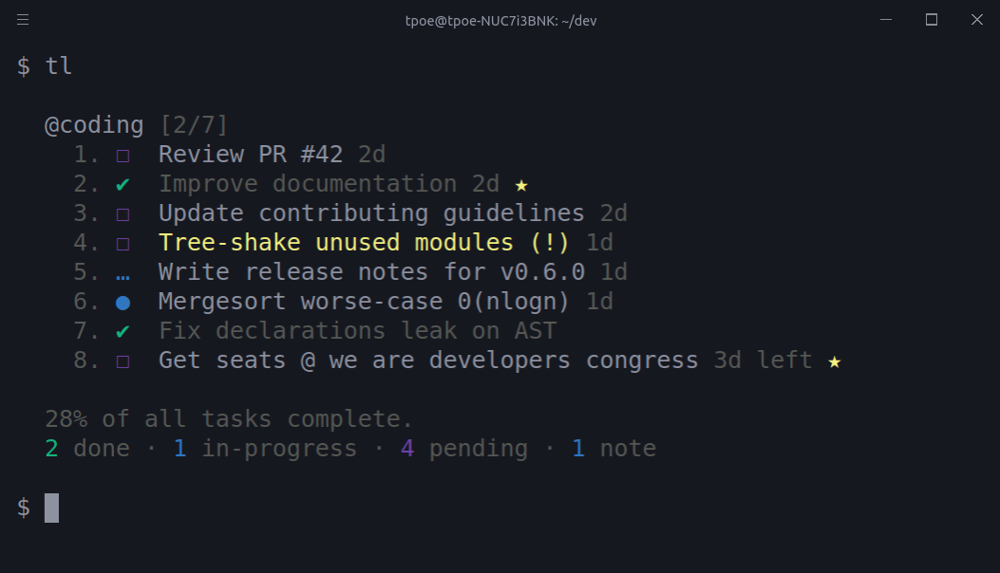
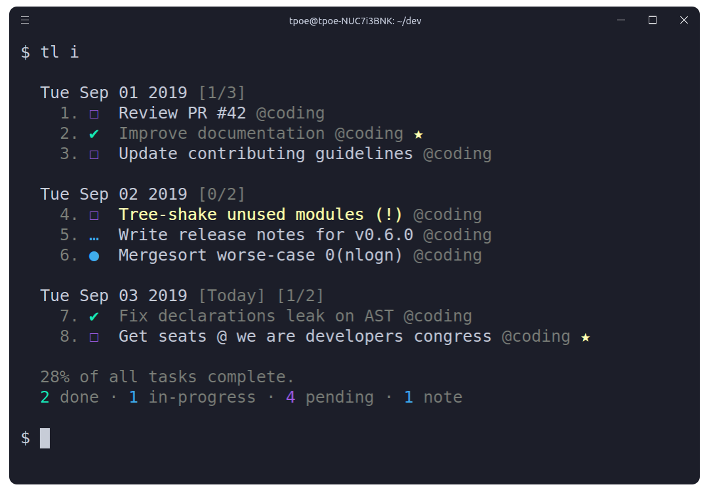

<h1 align="center">
  Taskline
</h1>

<h4 align="center">
  Aufgaben, Tafeln und Notizen für die Kommandozeile
</h4>

<div align="center">
  
</div>

<div align="center">
  <a href="https://travis-ci.org/perryrh0dan/taskline">
    
  </a>
  <a href="https://gitter.im/taskline/community?utm_source=badge&utm_medium=badge&utm_campaign=pr-badge">
    
  </a>
  <a href="https://www.npmjs.com/package/@perryrh0dan/taskline">
    
  </a>
  <a href="https://snapcraft.io/taskline">
    
  </a>
</div>

## Beschreibung

Durch die Verwendung einer einfachen und minimalen Syntax, die eine flache Lernkurve erfordert, können Sie mit Taskline Ihre Aufgaben und Notizen von Ihrem Terminal aus auf mehreren Tafeln effektiv verwalten. Alle Daten werden atomar in den Speicher geschrieben, um Verfälschungen zu vermeiden. Im Moment gibt es zwei Speichermodule. Das lokaler Speicher-Modul, in dem Ihre daten niemals für andere freigegeben werden, oder das Firestore-Modul, in dem Ihre Daten in Ihrer Firestore-Datenbank gespeichert werden und mit all Ihren Geräten synchronisiert werden können. Gelöschte Objekte werden automatisch archiviert und können jederzeit eingesehen oder wiederhergestellt werden.

Besuche die [contributing guidelines](https://github.com/perryrh0dan/taskline/blob/master/contributing.md#translating-documentation) um mehr zu erfahren, wie du diese Anleitung in eine andere Sprache übersetzen kannst.

Besuche mich auf [Gitter](https://gitter.im/taskline/community?source=orgpage) or [Twitter](https://twitter.com/perryrh0dan1) um Deine gedanken zu dem Projekt zu teilen.

## Highlights

### Original

* Aufgaben und Notizen zu Tafeln einordnen
* Tafel- und Zeitleistenansicht
* Prioritäten und Favoritenmechanismus
* Einträge suchen und filtern
* Einträge archivieren und wiederherstellen
* schlank & schnell
* Daten werden atomar an den Speicherort geschrieben
* Speicherort konfigurierbar
* Prozessübersicht
* Einfache und minimalistische Nutzungssyntax
* Aktualisierungsbenachrichtung
* Konfigurierbar durch `~/.taskline.json` 
* Daten sind als JSON gespeichert in `~/.taskline/storage` 

### Neu

* Modularer Datenspeicher
* Firestore-Modul, um Daten in google firestore zu speichern 
* Aufgaben über alle Geräte mit firestore synchronisieren.
* Meow durch commander.js ausgetauscht
* Fälligkeitsdatum
* Loadingspinner wird angezeigt während Netzwerkanfragen
* Neue Filterattribute für Listen

Die herausragenden Eigenschaften als Tafelansicht: [taskline board](https://raw.githubusercontent.com/perryrh0dan/taskline/master/media/highlights.png).

## Inhalt

* [Beschreibung](#beschreibung)
* [Highlights](#highlights)
* [Installation](#installation)
* [Nutzung](#nutzung)
* [Ansichten](#ansichten)
* [Konfiguration](#konfiguration)
* [Vor dem Flug](#vor-dem-flug)
* [Flughandbuch](#flughandbuch)
* [Entwicklung](#entwicklung)
* [Verwandt](#verwandt)
* [Team](#team)
* [Lizenz](#lizenz)

## Installation

### Yarn

``` bash
yarn global add @perryrh0dan/taskline
```

### NPM

``` bash
npm install --global @perryrh0dan/taskline
```

### Snapcraft

```bash
snap install taskline
snap alias taskline tl # set alias
```

**Note:** Due to the snap's strictly confined nature, both the storage & configuration files will be saved under the 
**Anmerkung:** Wegen der strikten Trennung in snap-Apps befinden sich die Konfigurationsdateien unter [`$SNAP_USER_DATA`](https://docs.snapcraft.io/reference/env) Umgebungsvariable anstatt in `$HOME` .
## Nutzung

``` 
$ tl --help
Anwendung: tl [options] [command]


Aufgaben, Tafeln & Notizen in der Kommandozeilenumgebung

Optionen:
  -V, --version                   Versionsinformationen ausgeben
  -h, --help                      Informationen zur Verwendung anzeigen

Commands:
  archive|a                       Archivierte Elemente anzeigen
  begin|b <ids>                   Aufgabe starten/pausieren
  check|c <ids>                   Aufgabe als erledigt/ unerledigt markieren
  clear                           Alle erledigten Aufgaben löschen
  copy|y <ids>                    Beschreibung zur Zwischenablage hinzufügen
  delete|d <ids>                  Eintrag löschen
  due <ids> <dueDate>             Fälligkeitsdatum einer Aufgabe setzen/löschen
  edit|e <id> <description>       Eintragsbeschreibung bearbeiten
  find|f <terms>                  Eintrag suchen
  list|l <terms>                  Eintrag nach Attributen suchen
  move|m <ids> <board>            Zwischen Tafeln verschieben
  note|n [options] <description>  Notiz erstellen
  priority|p <id> <priority>      Aufgabenpriorität bearbeiten
  restore|r <ids>                 Eintrag vom Archiv wiederherstellen
  star|s <ids>                    Eintrag hervorheben/Hervorhebung entfernen
  task|t [options] <description>  Aufgabe erstellen
  timeline|i                      Als Timeline darstellen
```

# Ansichten

### Tafelansicht

Der Aufruf von taskline ohne Parameter zeigt alle gespeicherten Elemente - gruppiert in den zugehörigen Tafeln.
 
<div align="center">
  
</div>

### Zeitleistenansicht

Um die Elemente in einer Zeitleistenansicht anzuzeigen kann der Parameter
 `--timeline` / `-i` 
verwendet werden. Die Elemente werden dann in der Reihenfolge der Erstellung angezeigt.

<div align="center">
  
</div>

## Konfiguration
Um Taskline zu konfigurieren, reicht es aus, die Datei  `~/.taskline.json` gemäß Deinen Vorstellungen anzupassen. 
Um zu den Standardwerten zurückzukommen, lösche einfach die Konfigurationsdatei aus Deinem home-Verzeichnis.

Das folgende Beispiel zeigt alle möglichen Optionen und deren Standardwerte.


``` json
{
  "tasklineDirectory": "~",
  "displayCompleteTasks": true,
  "displayProgressOverview": true,
  "storageModule": "local",
  "firestoreConfig": {
        "type": "",
        "project_id": "",
        "private_key_id": "",
        "private_key": "",
        "client_email": "",
        "client_id": "",
        "auth_uri": "",
        "token_uri": "",
        "auth_provider_x509_cert_url": "",
        "client_x509_cert_url": "",
      },
  "dateformat": "dd.mm.yyyy"
}
```

### Im Detail

##### `tasklineDirectory` 

* Type: `String` 
* Default: `~` 
Pfad im Dateisystem, an der sich der Speicherplatz befindet, zum Beispiel `/home/username/the-cloud` oder `~/the-cloud` 

Wird diese Option ausgelassen, ist der Speicherort `~` und die Einstellungen in `~/.taskline/` .

##### `displayCompleteTasks` 

* Type: `Boolean` 
* Default: `true` 

Als erledigt markierte Aufgaben anzeigen.

##### `displayProgressOverview` 

* Type: `Boolean` 
* Default: `true` 

Prozessübersicht unterhalb der Leistenansicht und der Tafelansicht anzeigen

##### `storageModule` 

* Type: `Enum` 
* Default: `local` 
* Values: `local` , `firestore` 

Choose of storage module. Currently there are two modules `local` and `firestore` . For the firestore module the firestoreConfig is needed.

##### `firestoreConfig` 

* Type: `Google Dienstkontoschlüssel` 
* Default: `Empty` 

Configuration of the firestore module.

##### `dateformat` 

* Type: `String` 
* Default: `dd.mm.yyyy` 

Dateformat used for duedate.

## Vor dem Flug

When you want to use the local storage module there is no further configuration need. When you want to use the firestore module follow this steps:

### Setup Firestore

1. Create a new Project on the google cloud platform.
2. Create a new service account for this project.
3. Download the authorization.json file and insert all the lines to the corresponding lines in the taskline configuration.

or follow this [instruction page](https://cloud.google.com/docs/authentication/production#providing_credentials_to_your_application).
## Flughandbuch

The following is a minor walkthrough containing a set of examples on how to use taskline.
In case you spotted an error or think that an example is not to clear enough and should be further improved, please feel free to open an [issue](https://github.com/perryrh0dan/taskline/issues/new/choose) or [pull request](https://github.com/perryrh0dan/taskline/compare).

### Task erstellen

To create a new task use the `task` / `t` command with your task's description following right after.

``` 
$ tl t "Improve documentation"
```

### Notiz erstellen

To create a new note use the `note` / `n` command with your note's body following right after.

``` 
$ tl n "Mergesort worse-case O(nlogn)"
```

### Tafel erstellen

Boards are automatically initialized when creating a new task or note. To create one or more boards, use the `--board` / `-b` option, followed by a list of boardnames, after the description of the about-to-be created item. As a result the newly created item will belong to all of the given boards. By default, items that do not contain any board option are automatically added to the general purpose; `My Board` .

``` 
$ tl t "Update contributing guidelines" -b coding,docs
```

### Task abhaken

To mark a task as complete/incomplete, use the `check` / `c` command followed by the ids of the target tasks. Note that the option will update to its opposite the `complete` status of the given tasks, thus checking a complete task will render it as pending and a pending task as complete. Duplicate ids are automatically filtered out.

``` 
$ tl c 1,3
```

### Task anfangen

To mark a task as started/paused, use the `begin` / `b` command followed by the ids of the target tasks. The functionality of this option is the same as the one of the above described `check` command.

``` 
$ tl b 2,3
```

### Item favorisieren

To mark one or more items as favorite, use the `star` / `s` command followed by the ids of the target items. The functionality of this option is the same as the one of the above described `check` command.

``` 
$ tl s 1,2,3
```

### Item beschreibung kopieren

To copy to your system's clipboard the description of one or more items, use the `copy` / `y` option followed by the ids of the target items. Note that the option will also include the newline character as a separator to each pair of adjacent copied descriptions, thus resulting in a clear and readable stack of sentences on paste.

``` 
$ tl y 1,2,3
```

### Tafeln anzeigen

Invoking taskline without any commands and options will display all of saved items grouped into their respective boards.

``` 
$ tl
```

### Zeitachse anzeigen

In order to display all items in a timeline view, based on their creation date, the `timeline` / `i` command can be used.

``` 
$ tl i
```

### Priorität setzen

To set a priority level for a task while initializing it, use the `-p` option followed by the priority. Priority can be an integer of value `1` , `2` or `3` . Note that all tasks by default are created with a normal priority - `1` .

* `1` - Normal priority
* `2` - Medium priority
* `3` - High priority

``` 
$ tl t "Fix issue `#42` " -b coding -p 3
```

To update the priority level of a specific task after its creation, use the `priority` / `p` command along with the id of the target tasks and an integer of value `1` , `2` or `3` .

``` 
$ tl p 1,2,23 2
```

### Frist setzen

To set a duedate for a task while initializing it, use the `-d` option followed by the duedate. Duedate must be a date of the format specified in the configuration file under dateformat. Default is `dd.mm.yyyy` . Note that all tasks by default have no duedate.

``` 
$ tl t "Solve puzzle" -b coding -d 23.08.2019
```

To update the duedate of a specified task after its creation, use the `due` command along with the id of the target tasks and an date. The `due` command has no available shorter alias.

``` 
$ tl due 1,2,23 15.09.2019
```

The number of duedays (days left before duedate) of a task is displayed instead of the age of an task right next to the description.

### item bewegen

To move items to one or more boards, use the `move` / `m` command, followed by the target items ids and the name of the destination boards. The default `My board` can be accessed through the `myboard` keyword.

``` 
$ tl m 1,2 myboard,reviews
```

### item löschen

To delete one or more items, use the `delete` / `d` command followed by the ids of the target items. Note that deleted items are automatically archived, and can be inspected or restored at any moment. Duplicate ids are automatically filtered out.

``` 
$ tl d 1,2
```

### Alle fertigen Aufgaben löschen

To delete/clear all complete tasks at once across all boards, use the `clear` command. Note that all deleted tasks are automatically archived, and can be inspected or restored at any moment. In order to discourage any possible accidental usage, the `clear` command has no available shorter alias.

``` 
$ tl clear
```

### Archiv anzeigen

To display all archived items, use the `archive` / `a` command. Note that all archived items are displayed in timeline view, based on their creation date.

``` 
$ tl a
```

### Items wiederherstellen

To restore one or more items, use the `restore` / `r` command followed by the id of the target items. Note that the ids of all archived items can be seen when invoking the `archive` / `a` option. Duplicate ids are automatically filtered out.

``` 
$ tl r 1,2
```

### Items nach Attributen filtern

To list a group of items where each item complies with a specific set of attributes, use the `list` / `l` command followed by the desired attributes. Board names along with item traits can be considered valid listing attributes. For example to list all items that belong to the default `myboard` and are pending tasks, the following could be used; 

``` 
$ tl l myboard,pending
```

The by default supported listing attributes, together with their respective aliases, are the following; 

* `myboard` - Items that belong to `My board` 
* `task` , `tasks` , `todo` - Items that are tasks.
* `note` , `notes` - Items that are notes.
* `pending` , `unchecked` , `incomplete` - Items that are pending tasks.
* `progress` , `started` , `begun` - Items that are in-progress tasks.
* `done` , `checked` , `complete` - Items that complete tasks.
* `star` , `starred` - Items that are starred.
* `default` , `medium` , `high` - Task that have the given priority.

### Nach items suchen

To search for one of more items, use the `find` / `f` command, followed by your search terms.

``` 
$ tl f documentation
```

## Entwicklung

For more info on how to contribute to the project, please read the [contributing guidelines](https://github.com/perryrh0dan/taskline/blob/master/contributing.md).

* Fork the repository and clone it to your machine
* Navigate to your local fork: `cd taskline` 
* Install the project dependencies: `npm install` or `yarn install` 
* Lint the code for errors: `npm test` or `yarn test` 

## Verwandt

* [signale](https://github.com/klaussinani/signale) - Highly configurable logging utility

## Team

* Thomas Pöhlmann [(@perryrh0dan)](https://github.com/perryrh0dan)

## Lizenz

[MIT](https://github.com/perryrh0dan/taskline/blob/master/license.md)

